## Requirements for Assignment-2
[Read the instruction](https://github.com/STIW3054-A221/class-activity-soc/blob/main/Assignment-2.md)

## Your Info:
1. Matric Number & Name & Photo & Phone Number
2. Other related info (if any)
 

Name &nbsp&nbsp&nbsp&nbsp&nbsp&nbsp&nbsp&nbsp&nbsp&nbsp&nbsp&nbsp&nbsp&nbsp&nbsp: Foo Roon Yi  
Matric Number &nbsp: 277088  
Phone Number &nbsp: 0187637620

## Introduction
A simple telegram bot can be built by writing some simple codes. Telegram bot API makes the development 
of telegram bots easy with a few of programming languages. For instance, there are some programming languages
being used in developing telegram bot such as Node. js, Java, Python, Rust as well as Elixir. In this assignment, 
Java is being used in the development of telegram bot. It is a widely used language in chat-bot projects development.
This is because Java has general purpose. It is also a platform-independent and portable language as well as it 
always implement object-oriented concepts.

Telegram bot can be created on the application Telegram, however, to make it have more functionality, Java is one of 
the best programming language to create it. It can also be connected to the database through SQLite to save and retrieve
the data. 

## Flow Diagram of the requirements (Use: https://app.diagrams.net/)
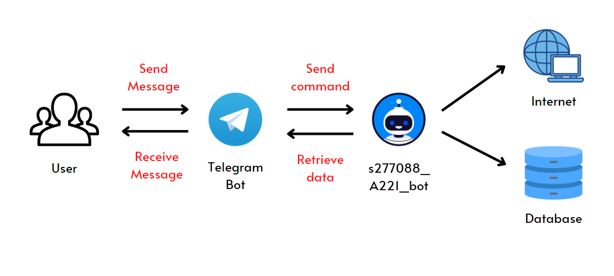

## Result/Output (Screenshot of the output)
 telegram bot link: https://t.me/s277088_A221_bot 
 When starting the s277088_A221_bot through /start: 
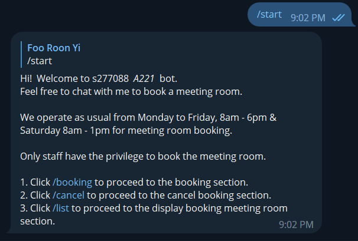 
 To book a meeting room through /booking: 
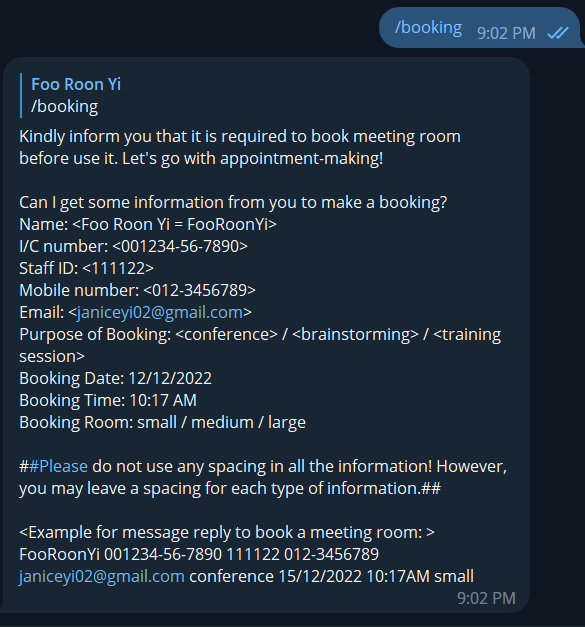 
 Book a meeting room successfully: 
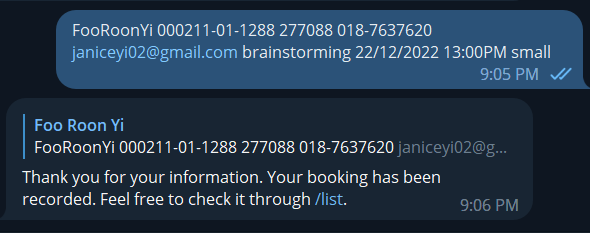 
 List the success booking: 
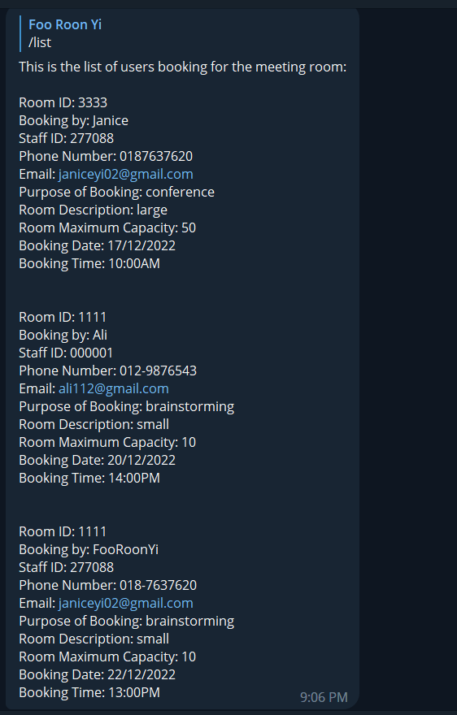 
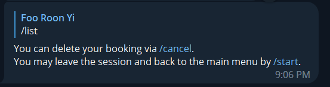 
 Cancel booking: 
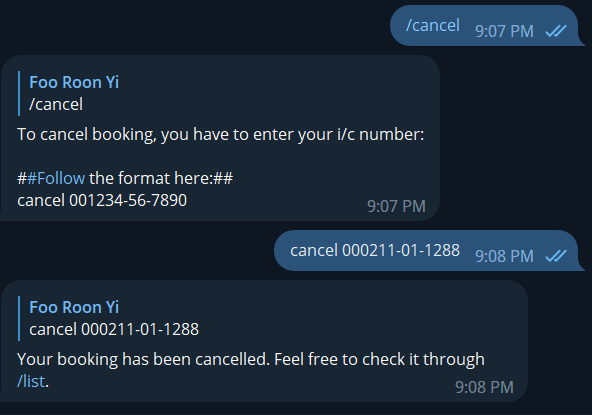

## UML Class Diagram
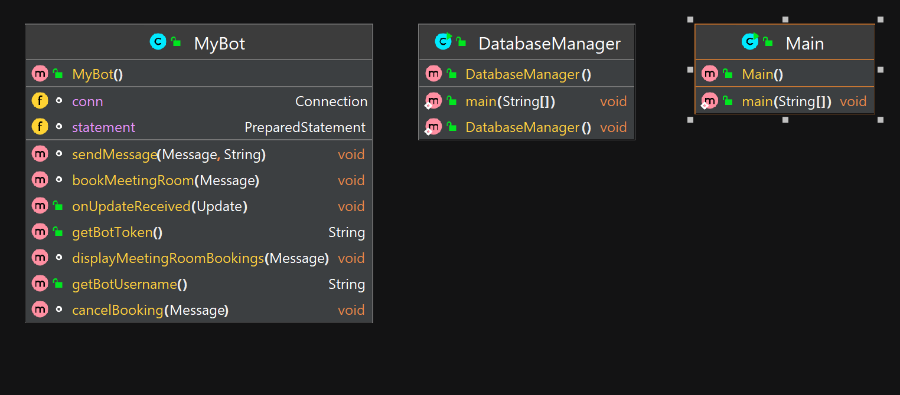

## Database design
Booking table: tbl_booking
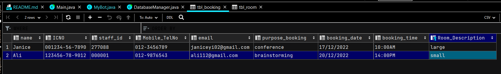

Room table: tbl_room
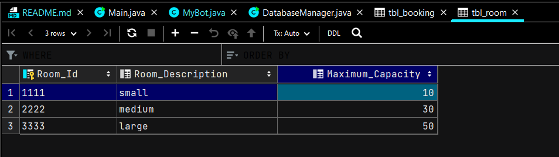

## Youtube Presentation
https://youtu.be/IRGTKd8Y-9c

## References (Not less than 10)
1. AutomationLabs, N. (2021, August 7). # 111 Internal Working of HashMap in Java | How HashMap works internally in java | Java | RedSysTech. YouTube. Retrieved December 16, 2022, from https://www.youtube.com/watch?v=HArvh9AZ1IE
2. Chau, V. (2022, September 13). Meeting room booking systems. Envoy. Retrieved December 16, 2022, from https://envoy.com/blog/meeting-room-booking-system/
3. Cicolella, M. (n.d.). FreedomoticBotHandlers.java example. Javatips.net. Retrieved December 16, 2022, from https://www.javatips.net/api/freedomotic-master/plugins/devices/telegram-bot/src/main/java/com/freedomotic/plugins/devices/telegrambot/FreedomoticBotHandlers.java
4. Fizz. (2020, June 23). Configuration JDBC drive with intlij IDEA || No suitable driver found for jdbc. YouTube. Retrieved December 16, 2022, from https://www.youtube.com/watch?v=duHgwpYLKZE
5. How to create a Telegram bot using java? (2020, December 21). Viral Vaghela. Retrieved December 16, 2022, from https://vaghelaviral.medium.com/how-to-create-a-telegram-bot-using-java-5710bed16c0f
6. java while (resultset.next()) does not return all data in the same column. (2020, July 23). Stack Overflow. Retrieved December 16, 2022, from https://stackoverflow.com/questions/63057745/java-while-resultset-next-does-not-return-all-data-in-the-same-column
7. Saving Game Data | Kodecentral.com. (2019, April 12). Kode Central. Retrieved December 16, 2022, from https://kodecentral.com/post/saving-game-data
8. SQLite Java: Deleting Data. (n.d.). SQLite Tutorial. Retrieved December 16, 2022, from https://www.sqlitetutorial.net/sqlite-java/delete/
9. SQLite Java: Select Data. (n.d.). SQLite Tutorial. Retrieved December 16, 2022, from https://www.sqlitetutorial.net/sqlite-java/select/
10. Telegram Bot - Process response from user based on last bot question. (2019, December 15). Stack Overflow. Retrieved December 16, 2022, from https://stackoverflow.com/questions/59341135/telegram-bot-process-response-from-user-based-on-last-bot-question
11. What does s.split("\\s+")) means here in the below code? (2016, October 17). Stack Overflow. Retrieved December 16, 2022, from https://stackoverflow.com/questions/40090776/what-does-s-split-s-means-here-in-the-below-code
12. Create a smart Telegram Chatbot in Java with Xatkit. (2021, December 27). Xatkit. Retrieved December 17, 2022, from https://xatkit.com/create-nlp-telegram-chatbot-in-java-with-xatkit/
13. Miller, S. (2022, August 26). Top 6 Programming Languages for Chatbot Development. Codecademy. Retrieved December 17, 2022, from https://www.codecademy.com/resources/blog/top-6-programming-languages-for-chatbot-development/
14. guide, s., & Goel, R. (n.d.). Java Telegram Bot Tutorial. Morioh. Retrieved December 17, 2022, from https://morioh.com/p/b06053c74a05

## JavaDoc
<a href='https://fooroonyi.github.io/JavadocAsg2/my/uum/package-summary.html'>Javadoc for Assignment 2</a>
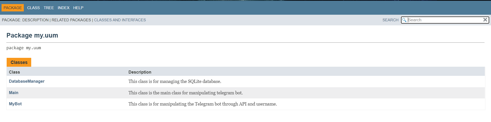
